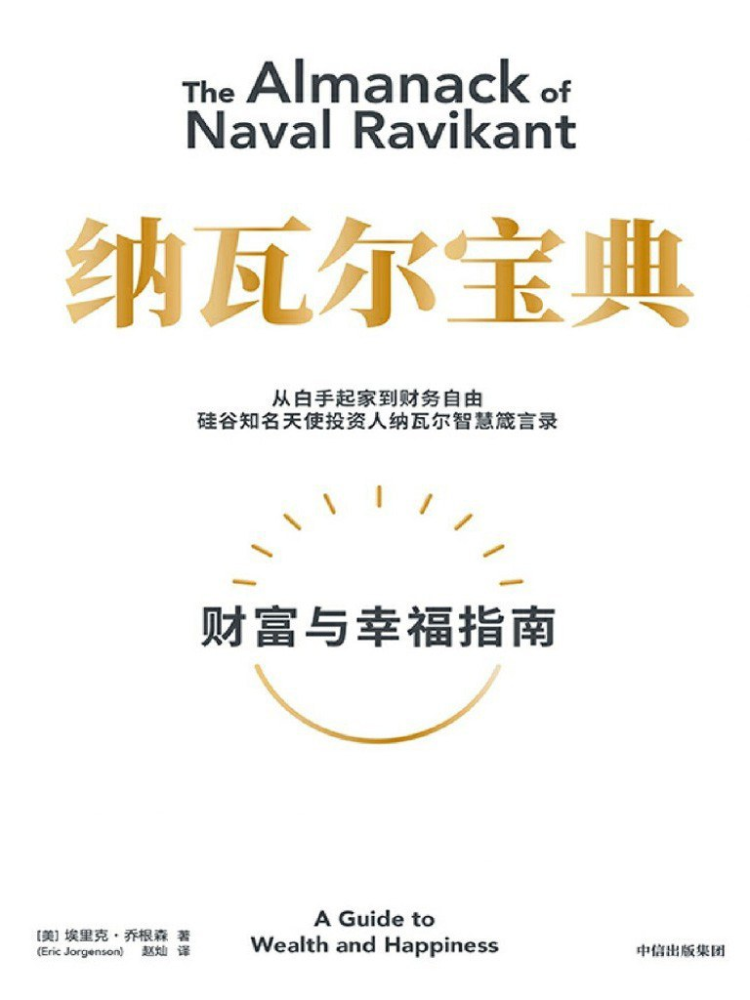

# 纳瓦尔的推荐阅读列表

> 整理了在《纳瓦尔宝典》中纳瓦尔推荐阅读的一些书籍和博客，并放上链接以便查阅。
> 另外，《纳瓦尔宝典》中提到的书籍有些是**直接将英文书名翻译为中文，而非对应中文译本的书名**，本文中作了一些修正工作，并**补充了一些中文版里被删减的灵性相关内容**，敬请查收。
> 整理者：Alistar

## 书籍
### 非虚拟类
- [《无穷的开始：世界进步的本源》戴维·多伊奇](https://book.douban.com/subject/26184242/)
  - 一本关于个人成长、事业发展和生活意义的启示录
- [《人类简史：从动物到上帝》尤瓦尔·赫拉利](https://book.douban.com/subject/25985021/)
  - 通过深入的历史研究和思考，揭示了人类历史的演进和发展的重要特点和趋势
- [《理性乐观派：一部人类经济进步史》马特·里德利](https://book.douban.com/subject/6913343/)
  - 通过对历史、经济和科学的综合分析，提出了一种理性乐观的观点，认为人类社会在不断进步和发展中，面临的挑战可以通过合作、创新和适应来克服
- [《基因组：生命之书 23 章》马特·里德利](https://book.douban.com/subject/35372216/)
  - 深入探索基因组的奥秘，揭示基因对生命和遗传的重要作用
- [《红色皇后：性与人性的进化》马特·里德利](https://book.douban.com/subject/1538996/)
  - 通过性选择理论，解释了性别、性行为和人类进化的关系
- [《美德的起源：人类本能与协作的进化》马特·里德利](https://book.douban.com/subject/1016822/)
  - 探讨了道德和合作行为的进化起源，以及其对人类社会的重要性
- [《自上而下：万物进化简史》马特·里德利](https://book.douban.com/subject/27000191/)
  - 从生物到文化，从分子到社会，展示了自然界中自上而下进化的普遍原理
- [《非对称风险》纳西姆·塔勒布](https://book.douban.com/subject/30417612/)
  - 揭示了不对称风险对经济和生活的影响，提供了应对不确定性的思考方式
- [《随机生存的智慧：黑天鹅语录》纳西姆·塔勒布](https://book.douban.com/subject/10598181/)
  - 通过引用和解读黑天鹅理论，探讨了不可预测事件对我们生活的重要性
- [《反脆弱》纳西姆·塔勒布](https://book.douban.com/subject/25782902/)
  - 讨论了如何通过适应和抗击不确定性，使个体、组织和社会变得更强大
- [《随机漫步的傻瓜》纳西姆·塔勒布](https://book.douban.com/subject/10773362/)
  - 解释了金融市场中的随机性和不确定性，提供了投资和决策的启示
- [《黑天鹅》纳西姆·塔勒布](https://book.douban.com/subject/6854525/)
  - 探讨了罕见事件的重要性，以及如何在不确定性中寻找机会和应对风险
- [《费曼讲物理：入门》理查德·费曼](https://book.douban.com/subject/33457293/)
  - 以通俗易懂的方式介绍物理学的基本概念和原理
- [《费曼讲物理：相对论》理查德·费曼](https://book.douban.com/subject/34860121/)
  - 深入讲解相对论的基本原理和应用
- [《费曼手札》理查德·费曼](https://book.douban.com/subject/3297608/)
  - 收录了费曼在物理学和科学哲学方面的思考和见解
- [《费曼传》詹姆斯·格雷森](https://book.douban.com/subject/1077935//)
  - 通过深入研究费曼的生平和科学成就，揭示了他作为一位天才科学家的独特魅力和影响力
- [《万物解释者：复杂事物的极简说明书》兰道尔·门罗](https://book.douban.com/subject/26814078/)
  - 以简洁明了的语言，解释了复杂事物的原理和规律，涵盖了物理学、生物学、经济学等多个领域
- [《趣味物理寻答集》刘易斯·卡罗尔·爱泼斯坦](https://book.douban.com/subject/6018690/)
  - 通过回答人们对物理学的各种好奇问题，让读者在趣味中了解物理学的基本概念和现象
- [《历史的教训》威尔·杜兰特，阿里尔·杜兰特](https://book.douban.com/subject/26279878/)
  - 通过对历史的回顾和分析，提出了一些关于人类社会和文明发展的重要观点
- [《The Sovereign Individual》詹姆斯·戴尔·戴维森等](https://book.douban.com/subject/1919172/)
  - 讨论了信息时代的到来对个人和社会的影响，并提出了一些关于未来的预测和建议
- [《穷查理宝典：查理·芒格智慧箴言录》查理·芒格](https://book.douban.com/subject/26831789/)
  - 收录了查理·芒格的智慧箴言和投资哲学，包括价值投资、决策思维和长期投资的原则
- [《现实不似你所见：量子引力之旅》卡洛·罗韦利](https://book.douban.com/subject/27156306/)
  - 带领读者探索量子物理和引力的奥秘，解释了量子力学和广义相对论的基本概念和实验验证
- [《七堂极简物理课》卡洛·罗韦利](https://book.douban.com/subject/26772731/)
  - 以简明易懂的方式介绍了物理学的基本概念和原理，包括力学、热学、电磁学等内容，适合初学者阅读
- [《The Compleat Strategyst: Being a Primer on the 
Theory of Games of Strategy》J·D·威廉斯](https://book.douban.com/subject/3718828/)
  - 介绍了策略博弈论在竞争中的应用，包括博弈理论的基本概念、策略分析和决策模型
- [《合作的进化》罗伯特·阿克塞尔罗德](https://book.douban.com/subject/26901444/)
  - 研究追求各自利益的个体的行为，提出一些关于个体动机的假设，并在此基础上推断整个系统的行为结果

### 哲学和灵性类
- [《开悟者眼中的生命真相》杰德·麦肯纳](https://book.douban.com/subject/26383445/)
- [《Jed McKenna’s Notebook》杰德·麦肯纳](https://book.douban.com/subject/6367043/)
- [《Jed Talk #1》杰德·麦肯纳](https://book.douban.com/subject/35768190/)
- [《Jed Talk #2》杰德·麦肯纳](https://www.amazon.com/Jed-Talks-Away-Things-Man-ebook/dp/B07HGCS5FD/)
- [《A Master's Secret Whispers》皮尔·古普塔](https://book.douban.com/subject/35594358/)
- [《直触真理：如何应对人生问题》皮尔·古普塔](https://book.douban.com/subject/36224273/)
- [《全然的自由：克里希那穆提主义》古杜·克里希那穆提](https://book.douban.com/subject/1367288/)
- [《悉达多》赫尔曼·黑塞](https://book.douban.com/subject/26980487/)
- [《The Book of Secrets》奥修](https://www.amazon.com/Book-Secrets-Meditations-Discover-Mystery/dp/0312650604)
- [《The Great Challenge》奥修](https://www.amazon.com/Great-Challenge-Exploring-World-within/dp/8172236840)
- [《The Way to Love: The Last Meditations of Anthony de Mello》安东尼·德·梅勒](https://www.amazon.com/Way-Love-Meditations-Anthony-Classics/dp/038524939X)
- [《The Untethered Soul: The Journey Beyond Yourself》Michael Singer](https://www.amazon.com/Untethered-Soul-Journey-Beyond-Yourself/dp/1572245379)
- [《清醒地活》迈克·辛格](https://book.douban.com/subject/35581777/)
- [《沉思录》马克·奥勒留](https://book.douban.com/subject/2359003/)
- [《Love Yourself Like Your Life Depends On It》卡马尔·拉维坎特](https://book.douban.com/subject/22992854/)
- [《The Tao of Seneca: Practical Letters from a Stoic Master》塞涅卡](https://www.amazon.com/The-Tao-of-Seneca-audiobook/dp/B01AIXEJ0U)
- [《改变你的心智》麦克·波伦](https://book.douban.com/subject/34955757/)
- [《醒思录：李小龙的生活智慧》李小龙](https://book.douban.com/subject/3876009/)
- [《先知》纪伯伦](https://book.douban.com/subject/2212371/)
